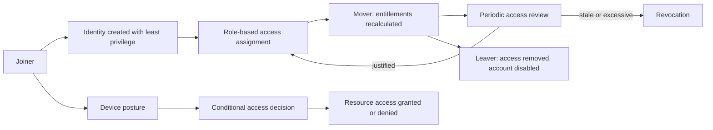

# IAM & Zero Trust Architecture
> Marcus Paula | Independent security engineering lab | Site A, Ireland
> Started: 2026-02-22 | Status: Active

Independent Identity and Access Management and Zero Trust laboratory containing reference architecture, synthetic case studies and automation examples.

---

## Scope

| Dimension | Detail |
|-----------|--------|
| Scenario scale | Synthetic enterprise-scale identity and endpoint population |
| Sites | Fictional Site A · Site B · Site C |
| OS coverage | Windows · macOS · Linux · iOS · Android |
| IAM platform | Active Directory · VPN · Crypt Access |
| MDM | MDM platform (macOS/iOS) · configuration-management platform · endpoint protection platform (Windows/Linux) |
| Compliance | GDPR concepts and generic data-handling requirements |
| Scripting | Bash · PowerShell · Batch |

---

## Repository Structure

```
iam-zero-trust-architecture/
├── case-studies/                    ← Real-world SE documentation
│   ├── iam-lifecycle-lab.md        ← AD lifecycle, provisioning, offboarding
│   ├── zero-trust-implementation.md ← ZT architecture & controls
│   └── linux-endpoint-hardening.md  ← Linux security baseline
├── scripts/
│   ├── bash/                        ← Linux automation scripts
│   ├── powershell/                  ← Windows/AD automation scripts
│   └── batch/                       ← Windows batch utilities
├── architecture/
│   ├── frameworks/                  ← Zero Trust frameworks & models
│   └── diagrams/                    ← Architecture diagrams (text-based)
├── requirements/                    ← IAM & ZT requirements specs
├── governance/                      ← Policies, CCB, compliance docs
└── resources/                       ← Study notes & references
```

---

## Case Studies

| Case Study | Scope | SE Areas | Status |
|-----------|-------|---------|--------|
| [IAM Lifecycle — multi-site lab](case-studies/iam-lifecycle-lab.md) | AD, VPN, provisioning a synthetic enterprise-scale population | Requirements, Architecture, V&V | ✅ Complete |
| [Zero Trust Implementation](case-studies/zero-trust-implementation.md) | ZT controls, access enforcement, compliance | Architecture, Security Reqs | ✅ Complete |
| [Linux Endpoint Hardening](case-studies/linux-endpoint-hardening.md) | Linux baseline, configuration-management platform, endpoint protection platform | Security Reqs, Config Mgmt | ✅ Complete |

---

## Scripts

| Script | Language | Purpose |
|--------|---------|---------|
| `ad-user-lifecycle.ps1` | PowerShell | AD user create/modify/disable/remove |
| `ad-audit-report.ps1` | PowerShell | Stale accounts & access audit |
| `onboard-user.sh` | Bash | Linux user onboarding automation |
| `offboard-user.sh` | Bash | Linux user offboarding + access revoke |
| `endpoint-hardening.sh` | Bash | Linux security baseline enforcement |
| `vpn-access-audit.sh` | Bash | VPN account audit & cleanup |
| `new-hire-setup.bat` | Batch | Windows new hire environment setup |
| `device-audit.bat` | Batch | Windows device inventory check |

---

## Zero Trust Pillars Covered

Based on CISA Zero Trust Maturity Model:

| Pillar | Implementation | Status |
|--------|---------------|--------|
| Identity | AD lifecycle + MFA + VPN + Crypt Access | ✅ Implemented |
| Devices | MDM enrollment (MDM platform/configuration-management platform/endpoint protection platform) + imaging standard | ✅ Implemented |
| Networks | VPN segmentation + site isolation | ✅ Implemented |
| Applications | Role-based access + onboarding/offboarding | ✅ Implemented |
| Data | Crypt Access + GDPR-compliant handling | ✅ Implemented |
| Visibility | Grafana monitoring + JIRA audit trail | ✅ Implemented |

---

## Key Outcomes

- a device-visibility target across multi-site lab (synthetic scale+ assets)
- no unauthorised access as a design objective incidents post-implementation
- a reduced manual-provisioning target
- Onboarding time reduced from days to hours
- Compliance mappings are illustrative and are not presented as audited production outcomes
- Audit-ready IAM documentation at all times

---

*Independent laboratory — sanitised public portfolio material*
*Marcus Paula | github.com/marcuspaula-seceng*


## Architecture



## What this repository contains

Architecture references, governance policy material and working scripts across PowerShell,
Bash, Python and batch, covering identity lifecycle, access review, VPN access audit and
endpoint hardening.

## Technologies

PowerShell · Bash · Python · Active Directory concepts · Zero Trust maturity model ·
least privilege · access governance

## Validation

Scripts were exercised in a controlled environment against synthetic input. There is no
automated test suite in this repository, and no CI pipeline. That is an accurate description
of its current maturity, not an oversight being hidden.

## Limitations

- **Not executed against a production identity provider.** Architecture and scripts are
  reference material built in a laboratory context.
- No automated tests and no CI. The scripts under `scripts/` are reviewed by reading, not by
  a gate.
- Policy documents describe intended controls; they are not evidence that those controls are
  enforced anywhere.
- Case studies are written as practice scenarios and should be read as such.

## Future improvements

- Pester coverage for the PowerShell components, matching the standard used in
  `active-directory-automation`.
- A CI workflow with read-only permissions.
- Replace narrative case studies with reproducible exercises that a reader can run.

---

## Project classification

This is an independent technical project using synthetic data and fictional scenarios. It does not contain employer systems, data, documentation or proprietary information.

## Engineering timeline

**Phase 1 — Security baseline.** Establish what access should look like before automating
anything: least privilege as the default, role-based assignment, and a defined lifecycle from
joiner through mover to leaver.

**Phase 2 — Investigation.** Map where access actually accumulates — group membership that
outlives a role change, accounts that stay enabled after departure, entitlements granted for a
project that ended.

**Phase 3 — Automation and validation.** Write the review and audit steps as scripts across
PowerShell, Bash and Python, exercised against synthetic input in a controlled environment.
CI validates syntax, Markdown structure and internal links on every pull request.

**Phase 4 — Outcome and lessons learned.** The CI gate caught a real defect on its first run:
a variable inside a string was being parsed as a scope modifier, so a script that looked
correct never ran. There is still no automated test suite here, and this README says so rather
than implying maturity the repository does not have.

## Testing

There is no automated test suite in this repository, and that is an accurate description of its
maturity rather than an omission being hidden.

What does run on every pull request: PowerShell parse validation across all scripts, shell
syntax checking with `bash -n`, Python compilation, balanced Markdown fences and resolution of
every relative link. Scripts themselves were exercised against synthetic input in a controlled
environment.

## Lessons learned

The validation workflow caught a real defect on its first run: in `ad-audit-report.ps1`, a
variable inside a double-quoted string was being parsed as a scope modifier, so a script that
read correctly would not run at all. It had been in the repository unnoticed.

The lesson is the same one that recurs across this portfolio — reading code is not testing it.
A parser is a cheap, deterministic check that finds a class of defect no amount of careful
reading reliably catches, and it belongs in CI before anything more sophisticated.

The next step here is Pester coverage matching the standard used in
`active-directory-automation`, not more documentation.
